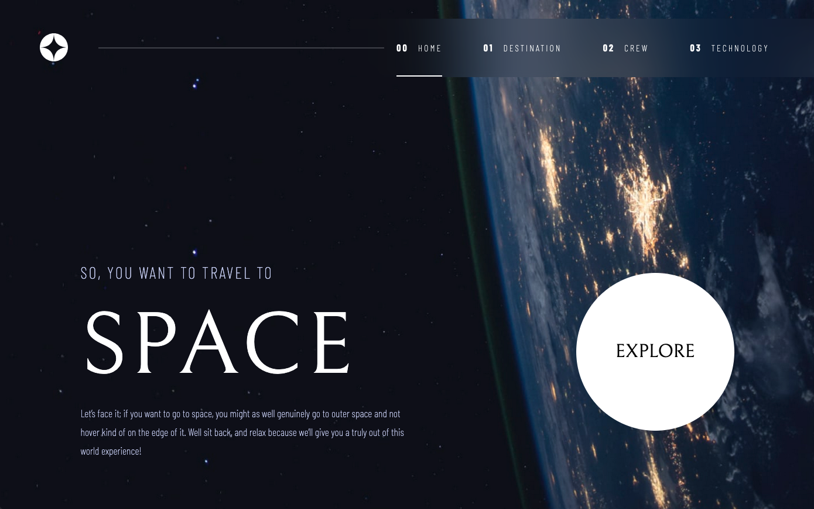
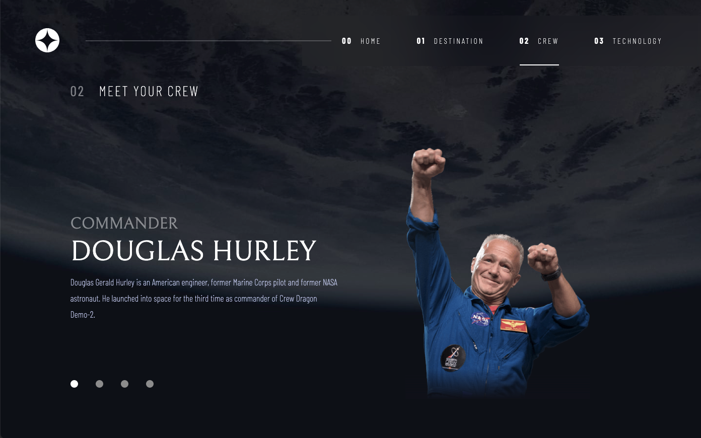
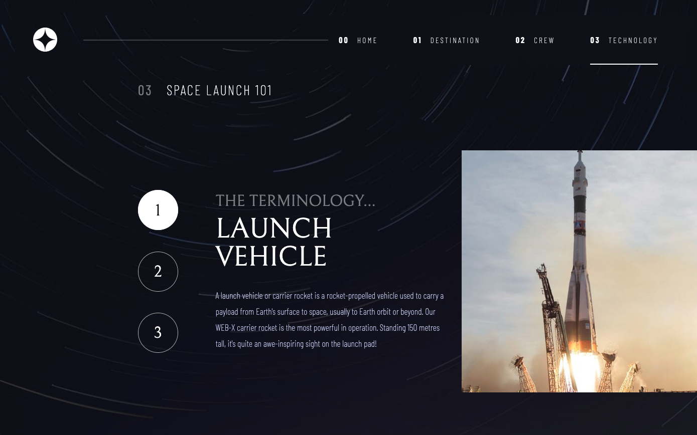
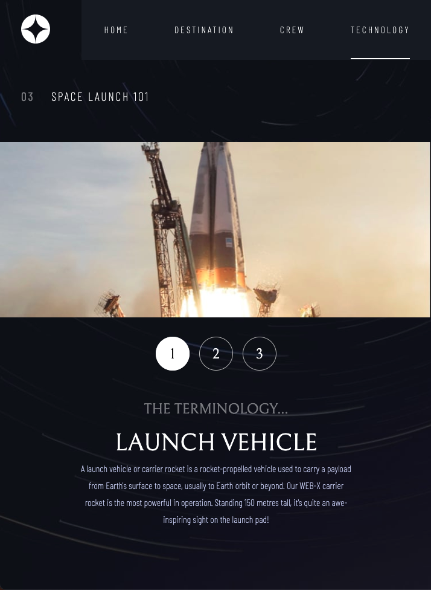
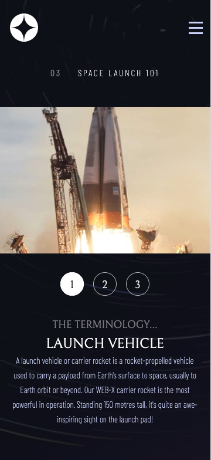
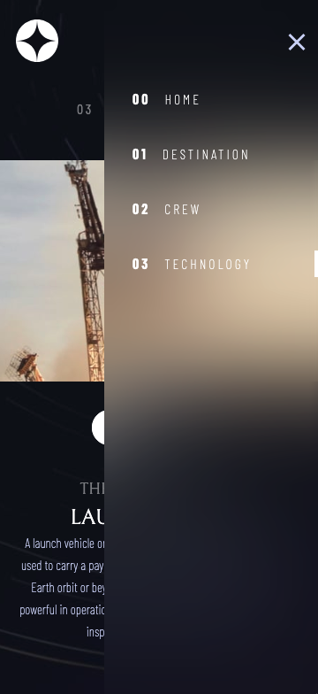

# Space Tourism Website - Frontend Mentor

This is a solution to the [Space tourism website challenge on Frontend Mentor](https://www.frontendmentor.io/challenges/space-tourism-multipage-website-gRWj1URZ3). Frontend Mentor challenges help you improve your coding skills by building realistic projects.

## Table of contents

- [Overview](#overview)
  - [The challenge](#the-challenge)
  - [Screenshots/Gifs](#screenshot)
  - [Links](#links)
- [My process](#my-process)
  - [Built with](#built-with)
  - [Continued development](#continued-development)
  - [Useful resources](#useful-resources)
- [Author](#author)

## Overview

### The challenge

Users should be able to:

- View the optimal layout for each of the website's pages depending on their device's screen size
- See hover states for all interactive elements on the page
- View each page and be able to toggle between the tabs to see new information

For most of this challenge I did not have access to Figma's developer mode. The design files provided by Frontend Mentor were modified slightly (mostly small layout changes) between when I started the project and when I completed it, so I was working with 2 different design files.

### Links

- [Solution URL](https://github.com/lexadecimals/space-tourism)
- [Live Site URL](https://lucky-mermaid-43f201.netlify.app/)

### Screenshots

#### Desktop

 
 

#### Tablet

#### Mobile

 

## My process

### Built with

- Semantic HTML5 markup
- Flexbox
- Grid
- Mobile-first workflow
- [React](https://reactjs.org/) - JS library
- [Styled Components](https://styled-components.com/) - For styles
- [Vite](https://vite.dev/) - Build Tool

### Continued development

- Testing with Jest
- Futher accessibility auditing

### Useful resources

## Author

- Github - [Lexadecimals](https://github.com/lexadecimals)
